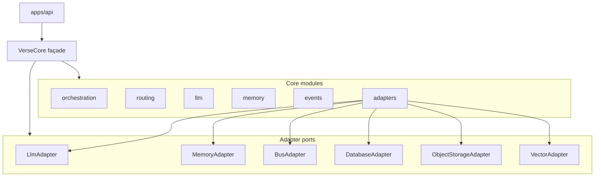

# `@at72-verse/verse-core`

Verse Core — **runtime host** library (ADR-001). Embedded in the API process at MVP behind a **minimal public façade**.

## Public API (Decision J1 / K)

Hosts (`apps/api`) import **only** from the package root:

```ts
import { createVerseCore } from "@at72-verse/verse-core";

const core = createVerseCore({ kernelBackend: "stub" });
const health = await core.health();
const kernel = core.createKernelClient(context); // host / Kernel factory only
```

Agents **never** import this package. They use `@at72-verse/verse-kernel` only.

## Non-goals (Phase 08)

- No Adam-specific (or any agent-specific) logic
- No imports from `agents/**`
- No business logic dumped into `VerseCore` — it **orchestrates modules + adapters**

## Modules

Logical modules from ARCHITECTURE §5.4 are registered in the manifest and surfaced by `health()`:



Phase 08 ships **noop** adapters that implement the definitive ports so future real providers swap transparently.

## Health (`GET /health/core`)

`health()` returns an extensible report: status, version, uptime, modules, adapters, active Kernel backend.

## Kernel backend (Decision L2)

Core can produce an in-process `KernelClient` for `VERSE_KERNEL_BACKEND=core`. The stub backend remains the CI/test reference; selection stays inside the Kernel factory — agents never see it.
